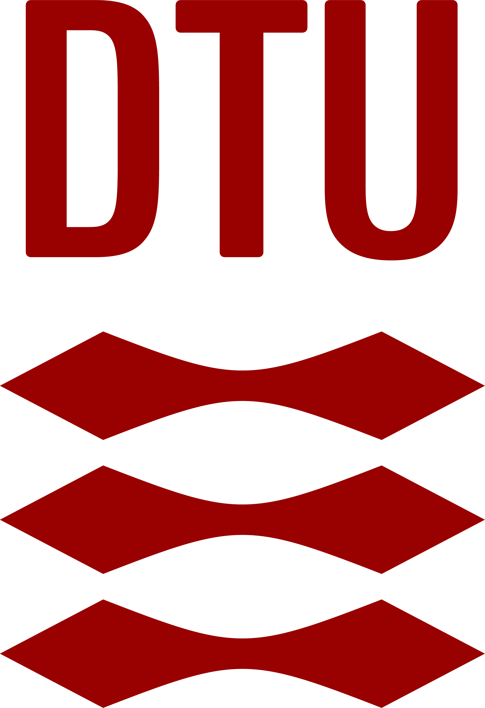

## Model Predictive and Imitation Learning Control for Efficient, Sustainable, and Safe Operations in Wastewater Stations Using Real-Time Edge Controllers Course. 
                                                       

 <b>
Technical University of Denmark  
Wind and Energy Systems<b>  

